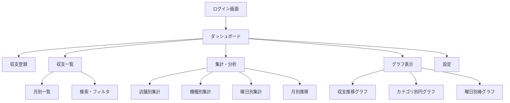

# パチスロ収支管理アプリ 実装計画

## 概要

Googleカレンダーをデータストアとして活用し、パチスロの収支を登録・集計・可視化するWebアプリ（PWA）を開発する。
PCブラウザおよびAndroid端末（ホーム画面追加）の両方から利用可能。

## 技術スタック

| カテゴリ | 技術 | 理由 |
|---------|------|------|
| フレームワーク | **Vite + Vue 3** | 高速ビルド、既存の経験を活用 |
| 言語 | **JavaScript** | 既存プロジェクトと統一 |
| ルーティング | **Vue Router 4** | SPA内ページ遷移 |
| グラフ | **Chart.js + vue-chartjs** | 豊富なグラフタイプ、軽量 |
| 認証 | **Google Identity Services (GIS)** | OAuth 2.0トークン取得 |
| API | **Google Calendar API v3** | REST API直接呼び出し |
| PWA | **vite-plugin-pwa** | Service Worker自動生成、インストール対応 |
| UI | **カスタムCSS** | ダークモード対応、スロット風テーマ |
| 日付処理 | **date-fns** | 軽量で高機能な日付ライブラリ |

---

## User Review Required

> [!IMPORTANT]
> ### Googleカレンダー イベントフォーマット
> 収支データをGoogleカレンダーのイベントとして保存する際のフォーマット案です。
> このフォーマットが使いづらい場合は変更可能です。

**イベントタイトル**: `[収支管理] {店舗名}`
- 例: `[収支管理] マルハン新宿東口店`
- `[収支管理]` プレフィックスで通常のカレンダーイベントと区別

**イベント時間**: 実際に稼働した日の終日イベント

**イベント説明欄（description）**: 構造化テキスト
```
投資: 30000
回収: 45000
機種: バジリスク絆2天膳
台番号: 456
メモ: AT直撃、6号機
```

- 各行が `キー: 値` 形式
- アプリ側でパース可能かつ、Googleカレンダーで直接見ても読みやすい
- `投資` と `回収` は必須、他はオプション

> [!WARNING]
> ### Google Cloud Console の事前設定が必要
> アプリの動作には以下のGoogle Cloud設定が必要です（開発開始前に実施）：
> 1. Google Cloud Consoleでプロジェクト作成
> 2. Google Calendar API の有効化
> 3. OAuth 2.0 クライアントIDの作成（Webアプリケーション）
> 4. 認証済みJavaScriptオリジンに `http://localhost:5173` を追加
> 5. OAuth同意画面の構成（スコープ: `calendar` / `calendar.events`）

---

## アプリケーション画面構成



### 各画面の詳細

#### 1. ログイン画面
- Googleアカウントでのログインボタン
- アプリの簡単な説明

#### 2. ダッシュボード
- 今月の収支サマリー（投資合計・回収合計・差額）
- 直近5件の収支履歴
- 今月の勝率
- 連勝/連敗記録
- クイックアクション（新規登録ボタン）

#### 3. 収支登録画面
- 日付選択（デフォルト: 今日）
- 店舗名入力（過去の入力履歴からサジェスト）
- 機種名入力（同上）
- 台番号（オプション）
- 投資金額入力
- 回収金額入力
- メモ（オプション）
- 登録ボタン → Googleカレンダーにイベント作成

#### 4. 収支一覧画面
- カレンダー表示 or リスト表示の切替
- 月別でのページネーション
- 各エントリの詳細表示・編集・削除
- フィルタ（店舗、機種、期間）
- ソート（日付、収支額）

#### 5. 集計・分析画面
- 期間指定（月次、年次、全期間、カスタム）
- **店舗別集計**: 店舗ごとの合計収支、訪問回数、勝率
- **機種別集計**: 機種ごとの合計収支、打った回数、勝率
- **曜日別集計**: 曜日ごとの平均収支、勝率
- **時系列集計**: 月別の収支推移

#### 6. グラフ表示画面
- 収支推移（折れ線グラフ）
- 店舗別収支（棒グラフ）
- 機種別収支割合（円グラフ）
- 曜日別平均収支（レーダーチャート / 棒グラフ）

#### 7. 設定画面
- Googleアカウント情報表示
- 使用するカレンダーの選択
- ログアウト

---

## Proposed Changes

### プロジェクト初期化

#### [NEW] プロジェクトルート
Vite + Vue 3 プロジェクトを `c:\WorkSpace\収支管理アプリ` に作成

```
収支管理アプリ/
├── public/
│   ├── favicon.svg
│   ├── pwa-192x192.png
│   └── pwa-512x512.png
├── src/
│   ├── assets/
│   │   └── styles/
│   │       ├── main.css          # グローバルスタイル
│   │       ├── variables.css     # CSS変数（カラーパレット等）
│   │       └── components.css    # 共通コンポーネントスタイル
│   ├── components/
│   │   ├── common/
│   │   │   ├── AppHeader.vue     # ヘッダー（ナビゲーション）
│   │   │   ├── AppSidebar.vue    # サイドバーメニュー
│   │   │   ├── LoadingSpinner.vue
│   │   │   └── EmptyState.vue
│   │   ├── dashboard/
│   │   │   ├── SummaryCard.vue    # サマリーカード
│   │   │   ├── RecentHistory.vue  # 直近履歴
│   │   │   └── QuickStats.vue     # 勝率等
│   │   ├── entry/
│   │   │   ├── EntryForm.vue      # 収支登録フォーム
│   │   │   └── SuggestInput.vue   # サジェスト付き入力
│   │   ├── list/
│   │   │   ├── EntryTable.vue     # 一覧テーブル
│   │   │   ├── EntryCard.vue      # カード表示（モバイル用）
│   │   │   └── FilterPanel.vue    # フィルタパネル
│   │   ├── analytics/
│   │   │   ├── StoreAnalytics.vue   # 店舗別集計
│   │   │   ├── MachineAnalytics.vue # 機種別集計
│   │   │   ├── WeekdayAnalytics.vue # 曜日別集計
│   │   │   └── PeriodSelector.vue   # 期間選択
│   │   └── charts/
│   │       ├── TrendChart.vue       # 収支推移
│   │       ├── StoreChart.vue       # 店舗別チャート
│   │       ├── MachineChart.vue     # 機種別チャート
│   │       └── WeekdayChart.vue     # 曜日別チャート
│   ├── composables/
│   │   ├── useAuth.js             # Google認証
│   │   ├── useCalendar.js         # Googleカレンダー操作
│   │   ├── useEntries.js          # 収支データ管理
│   │   └── useAnalytics.js        # 集計ロジック
│   ├── router/
│   │   └── index.js               # ルーティング設定
│   ├── utils/
│   │   ├── calendarParser.js      # イベントのパース/フォーマット
│   │   ├── dateUtils.js           # 日付ユーティリティ
│   │   └── formatters.js          # 数値フォーマット等
│   ├── views/
│   │   ├── LoginView.vue
│   │   ├── DashboardView.vue
│   │   ├── EntryView.vue         # 収支登録
│   │   ├── ListView.vue          # 収支一覧
│   │   ├── AnalyticsView.vue     # 集計・分析
│   │   ├── ChartsView.vue        # グラフ表示
│   │   └── SettingsView.vue      # 設定
│   ├── App.vue
│   └── main.js
├── index.html
├── vite.config.js
└── package.json
```

---

### 認証モジュール

#### [NEW] [useAuth.js](file:///c:/WorkSpace/収支管理アプリ/src/composables/useAuth.js)

Google Identity Servicesを使用したOAuth 2.0認証:

- `google.accounts.oauth2.initTokenClient()` でトークンクライアント初期化
- スコープ: `https://www.googleapis.com/auth/calendar` (読み書き)
- ログイン状態の管理（reactive state）
- アクセストークンの保持・リフレッシュ
- ログアウト機能

```javascript
// 使用イメージ
const { isLoggedIn, user, login, logout, accessToken } = useAuth()
```

---

### カレンダー操作モジュール

#### [NEW] [useCalendar.js](file:///c:/WorkSpace/収支管理アプリ/src/composables/useCalendar.js)

Google Calendar API v3 のREST呼び出し:

- **イベント取得**: `GET /calendars/{calendarId}/events` で期間指定してイベント一覧取得
- **イベント作成**: `POST /calendars/{calendarId}/events` で新規収支登録
- **イベント更新**: `PUT /calendars/{calendarId}/events/{eventId}` で編集
- **イベント削除**: `DELETE /calendars/{calendarId}/events/{eventId}` で削除
- カレンダーリスト取得（設定画面用）

```javascript
// 使用イメージ
const { fetchEntries, createEntry, updateEntry, deleteEntry } = useCalendar()
```

---

### データパーサー

#### [NEW] [calendarParser.js](file:///c:/WorkSpace/収支管理アプリ/src/utils/calendarParser.js)

Googleカレンダーイベント ↔ アプリ内データモデルの変換:

```javascript
// アプリ内データモデル
{
  id: 'event_id',           // GoogleカレンダーイベントID
  date: '2026-04-20',       // 日付
  store: 'マルハン新宿東口店',  // 店舗名
  machine: 'バジリスク絆2天膳', // 機種名
  investment: 30000,          // 投資額（円）
  collection: 45000,          // 回収額（円）
  profit: 15000,              // 収支（自動計算）
  slotNumber: '456',          // 台番号
  memo: 'AT直撃',             // メモ
  dayOfWeek: '月'             // 曜日（自動計算）
}
```

- `parseEvent(calendarEvent)` → アプリ内モデルに変換
- `formatEvent(entryData)` → カレンダーイベント形式に変換
- `[収支管理]` プレフィックスによるフィルタリング

---

### 集計ロジック

#### [NEW] [useAnalytics.js](file:///c:/WorkSpace/収支管理アプリ/src/composables/useAnalytics.js)

クライアントサイドでのデータ集計:

| 集計種別 | 出力内容 |
|---------|---------|
| **店舗別** | 店舗名、合計投資、合計回収、合計収支、訪問回数、勝率、平均収支 |
| **機種別** | 機種名、合計投資、合計回収、合計収支、稼働回数、勝率、平均収支 |
| **曜日別** | 曜日、合計収支、稼働回数、勝率、平均収支 |
| **月別推移** | 年月、合計投資、合計回収、合計収支、稼働日数、勝率 |
| **総合** | 総投資、総回収、総収支、総稼働回数、通算勝率、最大勝ち/負け |

---

### UI/デザインコンセプト

#### テーマ: 「Premium Dark」

- **配色**: ダークモード基調
  - 背景: `#0f0f1a` → `#1a1a2e`（グラデーション）
  - カード: `#16213e` with `rgba(255,255,255,0.05)` ボーダー
  - アクセント: `#00d4ff`（シアン系）+ `#7c3aed`（紫系）
  - 勝ち: `#22c55e`（グリーン）
  - 負け: `#ef4444`（レッド）
- **エフェクト**: Glassmorphism、微細なアニメーション
- **フォント**: Inter（数値）+ Noto Sans JP（日本語）
- **レスポンシブ**: モバイルファースト、PC表示時はサイドバー展開

---

## 開発フェーズ

### Phase 1: プロジェクト初期化・認証（Day 1）
1. Viteプロジェクト作成、依存パッケージインストール
2. CSS設計（変数、グローバルスタイル）
3. Vue Router設定
4. Google OAuth認証実装
5. ログイン/ログアウト画面

### Phase 2: データ層・登録機能（Day 2）
1. カレンダーAPI連携（useCalendar.js）
2. データパーサー（calendarParser.js）
3. 収支登録フォーム
4. 登録データのカレンダーイベント作成

### Phase 3: 一覧・ダッシュボード（Day 3）
1. ダッシュボード画面
2. 収支一覧画面（テーブル/カード表示）
3. フィルタ・ソート機能
4. 編集・削除機能

### Phase 4: 集計・グラフ（Day 4）
1. 集計ロジック実装
2. 店舗別・機種別・曜日別集計画面
3. Chart.jsによるグラフ表示
4. 期間指定機能

### Phase 5: PWA化・仕上げ（Day 5）
1. PWA設定（マニフェスト、アイコン、Service Worker）
2. オフライン対応（キャッシュ戦略）
3. レスポンシブ調整
4. パフォーマンス最適化

---

## Open Questions

> [!IMPORTANT]
> ### 1. 同一日に複数の稼働を記録する場合
> 1日に複数の店舗や機種で遊技した場合、それぞれ別のイベントとして登録する形でよいですか？
> （例: 午前はマルハンでバジリスク、午後はジャグラー → 2つのイベント）

> [!IMPORTANT]
> ### 2. Google Cloud プロジェクトの準備
> Google Cloud ConsoleでのOAuthクライアントID等の設定は、ご自身で行いますか？
> 手順書を用意することも可能です。

> [!IMPORTANT]
> ### 3. 初期データについて
> 既にGoogleカレンダーに収支データを登録済みですか？
> または新規にこのアプリから登録を始める想定ですか？
> （既存データがある場合、フォーマットの互換性を考慮する必要あり）

---

## Verification Plan

### 自動テスト
- データパーサーの単体テスト（パース/フォーマット変換の正確性）
- 集計ロジックの単体テスト（各集計結果の正確性）

### 手動検証
- ブラウザでの動作確認（Chrome DevTools レスポンシブモード）
- Googleアカウントでの認証フロー確認
- カレンダーへのイベント作成/読み取り/更新/削除
- 各集計画面のデータ正確性確認
- Android Chrome での PWA インストール + ホーム画面からの起動確認
- Lighthouse による PWA スコア確認
